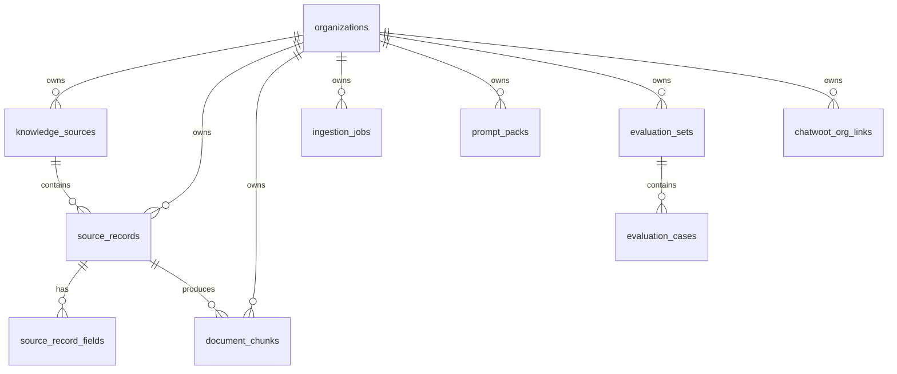

# Kganya Prisma Schema Draft

## Purpose

This is the target backend schema for Project Kganya.

It is not an ASC rewrite.

It is a Kganya-native model built to support:

- UP support knowledge base content
- structured row sources
- editable source records in the console
- derived `pgvector` retrieval
- evaluation sets and metrics
- future Chatwoot channel mapping

## Design Rules

- `organization_id` is the only tenant key.
- Clerk owns authentication.
- Postgres owns source-of-truth data.
- `document_chunks` is the only retrieval table.
- source records are editable truth.
- chunks are derived and replaceable.
- the UI should keep its editing flow stable while backend tables change.

## Core Model

## Tables

### `organizations`

Tenant root.

Fields:
- `id` UUID PK
- `clerk_org_id` text unique
- `name` text
- `slug` text unique
- `status` text
- `created_at`
- `updated_at`

### `knowledge_sources`

Source inventory and lineage root.

This is the canonical record of where content came from:

- markdown file
- CSV row set
- spreadsheet import
- manual article
- external URL

Fields:
- `id` UUID PK
- `organization_id` UUID FK
- `source_key` text
- `source_family` text
- `source_type` text
- `title` text
- `canonical_ref` text
- `original_uri` text
- `original_path` text
- `status` text
- `last_verified_at` timestamptz
- `created_at`
- `updated_at`

Suggested unique constraints:
- `(organization_id, source_key)`

Suggested indexes:
- `organization_id`
- `source_family`
- `source_type`

### `source_records`

Editable canonical content records.

This table holds the actual content the staff console edits.

Fields:
- `id` UUID PK
- `organization_id` UUID FK
- `record_key` text
- `knowledge_source_id` UUID FK
- `topic` text
- `source_kind` text
- `title` text
- `body_markdown` text nullable
- `body_json` jsonb nullable
- `source_url` text nullable
- `source_anchor` text nullable
- `version` integer
- `status` text
- `active` boolean
- `checksum` text
- `created_by` text nullable
- `created_at`
- `updated_at`

Usage rules:
- unstructured content lives in `body_markdown`
- structured row data can live in `body_json`
- `record_key` keeps multiple row documents under the same source from colliding
- the UI may still show column-like editing, but the backend stores a canonical record

Suggested unique constraints:
- `(organization_id, knowledge_source_id, record_key, version)`

Suggested indexes:
- `organization_id`
- `(organization_id, knowledge_source_id, active)`
- `topic`
- `status`

### `source_record_fields`

Optional row-level field table for structured sources.

Use this when the UI needs field-by-field edits for row-based data.

Fields:
- `id` UUID PK
- `source_record_id` UUID FK
- `field_name` text
- `field_value` text
- `field_type` text
- `field_order` integer
- `is_key` boolean
- `created_at`
- `updated_at`

Suggested indexes:
- `(source_record_id, field_order)`
- `(source_record_id, field_name)`

### `document_chunks`

Derived retrieval chunks only.

This is the only table that retrieval should query.

Fields:
- `id` UUID PK
- `organization_id` UUID FK
- `knowledge_source_id` UUID FK
- `source_record_id` UUID FK
- `version` integer
- `chunk_index` integer
- `chunk_type` text
- `source_family` text
- `topic` text
- `title` text
- `section_path` text nullable
- `chunk_text` text
- `chunk_hash` text
- `embedding` vector nullable while the embedding provider is still pending
- `embedding_model` text
- `active` boolean
- `retired_at` timestamptz nullable
- `created_at`
- `updated_at`

Suggested unique constraints:
- `(organization_id, source_record_id, version, chunk_index)`

Suggested indexes:
- `organization_id`
- `(organization_id, knowledge_source_id, active)`
- `(organization_id, topic, active)`
- `embedding` vector index

### `ingestion_jobs`

Tracks normalization, chunking, embedding, replacement, and retries.

Fields:
- `id` UUID PK
- `organization_id` UUID FK
- `knowledge_source_id` UUID FK
- `source_record_id` UUID FK nullable
- `job_type` text
- `state` text
- `input_checksum` text nullable
- `output_checksum` text nullable
- `error_message` text nullable
- `retry_count` integer
- `started_at` timestamptz nullable
- `finished_at` timestamptz nullable
- `created_at`
- `updated_at`

Suggested indexes:
- `organization_id`
- `(organization_id, knowledge_source_id, state)`
- `state`

### `prompt_packs`

Tenant-specific prompts and response styles.

Fields:
- `id` UUID PK
- `organization_id` UUID FK
- `name` text
- `channel` text
- `system_prompt` text
- `style_prompt` text nullable
- `fallback_prompt` text nullable
- `active` boolean
- `version` integer
- `created_at`
- `updated_at`

Suggested unique constraints:
- `(organization_id, name, version)`

### `evaluation_sets`

Groups evaluation cases for retrieval and answer quality.

Fields:
- `id` UUID PK
- `organization_id` UUID FK
- `name` text
- `source_name` text
- `status` text
- `created_at`
- `updated_at`

### `evaluation_cases`

Gold questions, expected categories, and expected answer traits.

Fields:
- `id` UUID PK
- `evaluation_set_id` UUID FK
- `prompt_text` text
- `expected_category` text
- `expected_answer_trait` text
- `expected_source_key` text nullable
- `expected_chunk_hint` text nullable
- `status` text
- `created_at`
- `updated_at`

### `retrieval_metrics`

Optional runtime metrics and threshold tracking.

Fields:
- `id` UUID PK
- `organization_id` UUID FK
- `metric_key` text
- `metric_value` numeric
- `threshold_value` numeric nullable
- `observed_at` timestamptz
- `created_at`

### `chatwoot_org_links`

Maps the organization to Chatwoot.

Fields:
- `id` UUID PK
- `organization_id` UUID FK
- `chatwoot_account_id` text
- `chatwoot_inbox_id` text
- `channel` text
- `active` boolean
- `created_at`
- `updated_at`

### `organization_memberships`

If the app keeps a local access layer in addition to Clerk, this table stores it.

Fields:
- `id` UUID PK
- `organization_id` UUID FK
- `clerk_user_id` text
- `email` text
- `role` text
- `status` text
- `created_at`
- `updated_at`

### `access_audit_logs`

Keeps an audit trail for role or access changes.

Fields:
- `id` UUID PK
- `organization_id` UUID FK
- `actor_user_id` text
- `target_user_id` text
- `actor_email` text nullable
- `target_email` text nullable
- `previous_role` text
- `new_role` text
- `previous_permissions` jsonb
- `new_permissions` jsonb
- `created_at`

## Knowledge Base Mapping

The knowledge-base folder should map into this schema as follows:

- Markdown articles:
  - `registration.md`
  - `module-change.md`
  - `fees.md`
  - `payments-and-refunds.md`
  - `accommodation.md`
  - `residence-placement.md`
  - `admissions.md`
  - `application-status.md`
  - `nsfas-and-funding.md`
  - `bursaries-and-scholarships.md`
  - `student-portal.md`
  - `login-and-access.md`
  - `programmes-and-modules.md`
  - `academic-calendar.md`
  - `examinations-results-and-graduation.md`
  - `complaints-and-escalation.md`
  - `competitor-pricing-analysis.md`
  - map to `knowledge_sources`, `source_records`, and `document_chunks`

- CSV inventory and evaluation files:
  - `source_inventory.csv`
  - `faq_gold_set.csv`
  - `question_clusters.csv`
  - `kpi_baseline_and_thresholds.csv`
  - `complaint_theme_log.csv`
  - map to `knowledge_sources`, `source_records`, `source_record_fields`, `evaluation_sets`, `evaluation_cases`, and `retrieval_metrics`

## Migration Order

1. Create the new tables.
2. Backfill knowledge sources from the knowledge-base folder.
3. Backfill source records from markdown and CSV inputs.
4. Generate document chunks.
5. Populate evaluation sets and cases.
6. Wire the UI to the new backend contract.
7. Retire legacy ASC tables after cutover.

## What Not To Build

- Do not keep ASC tables as domain tables.
- Do not use `document_chunks` for editing.
- Do not use `source_records` as a denormalized dump.
- Do not make vector rows the source of truth.
- Do not let the UI depend on old schema names once the new tables exist.
