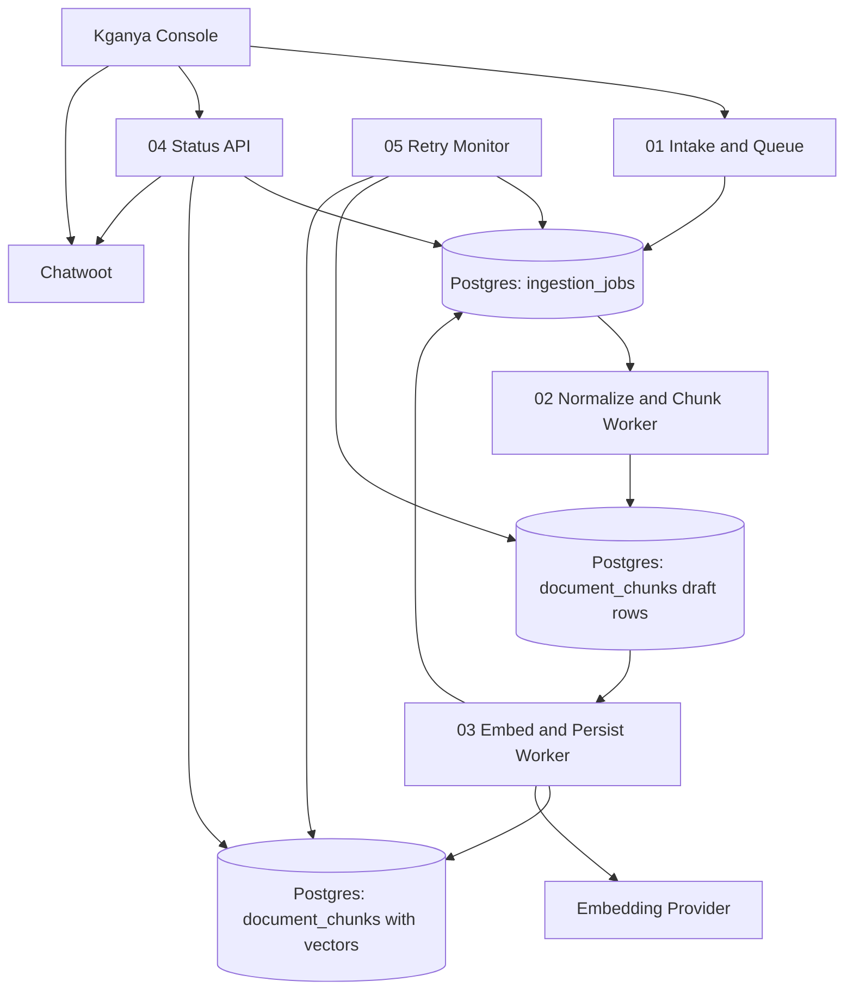

# Workflow Architecture

## Recommended Topology

## Why This Is The Better Shape

- The intake path stays short and predictable.
- Normalization and embedding become restartable workers.
- Postgres holds the durable handoff, not n8n memory.
- The status API can report reality instead of guessing from one long shared execution.
- Retry logic becomes a bounded maintenance task, not a side branch inside the critical path.
- The auth-gated status path stays separated from the hot ingest path.

## Reversal Condition

I would reconsider this split only if:

- the batch volume is so tiny that the extra workflows add more operational cost than they save, or
- the provider and database are guaranteed to stay below timeout and failure thresholds, which is unlikely for this use case.
