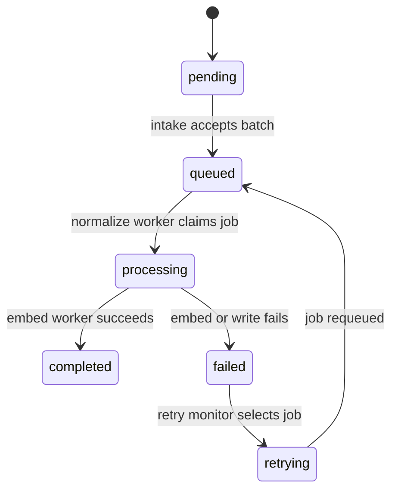

# Workflow Connections

## Decision

Use the database as the handoff boundary between workflows.

That is the better design here than chaining one giant n8n execution:

- the console gets a fast acknowledgement
- the workers can restart independently
- retries do not depend on one long execution surviving
- tenant isolation stays explicit in every read and write

## Workflow Roles

| Workflow | Role | Trigger | Reads | Writes |
|---|---|---|---|---|
| `01 Intake and Queue` | Accept and enqueue | Webhook | request body, `organizations` | `ingestion_jobs` |
| `02 Normalize and Chunk Worker` | Normalize source rows and create draft chunks | Cron | `ingestion_jobs`, `organizations`, `knowledge_sources`, `source_records`, `source_record_fields` | `document_chunks`, `ingestion_jobs` |
| `03 Embed and Persist Worker` | Generate embeddings and finalize chunk bundles | Cron | `document_chunks`, `ingestion_jobs` | `document_chunks`, `ingestion_jobs` |
| `04 Status API` | Read-only operator status | Webhook | `ingestion_jobs`, `document_chunks` | none |
| `05 Retry Monitor` | Requeue retryable failures | Cron | `ingestion_jobs` | `ingestion_jobs` |

## Shared Handoff Rules

1. `organizationId` is the hard tenant boundary.
2. `batchId` is the intake idempotency key.
3. `sourceRecordId` is the lineage anchor for derived chunks.
4. `ingestion_jobs.state` is the operator-visible state.
5. `02` must claim jobs atomically with `SKIP LOCKED` or an equivalent transactional lock.
6. `03` must operate on a `sourceRecordId + version` bundle, not a single chunk in isolation.
7. Draft chunks are written before embeddings so the worker path can be resumed safely.
8. Embedding writes only happen after the provider returns vectors.
9. `04` must authenticate the caller and scope the response to the caller's organization.
10. `05` must use structured failure metadata, not free-text error parsing.

## State Flow

## What Connects To What

- `01` writes queued ingestion jobs into Postgres and reports duplicates explicitly.
- `02` reads queued ingestion jobs and writes draft chunks.
- `03` reads draft chunks by source-record bundle and writes vectors.
- `04` reads the current job state and returns it to the console after auth verification.
- `05` moves eligible failures back to queued state using structured retry fields.

## What Not To Do

- Do not pass large embeddings through webhook payloads between workflows.
- Do not keep the intake workflow open while embedding or persistence runs.
- Do not let retry logic invent a new tenant boundary.
- Do not treat `document_chunks` as source-of-truth input.
- Do not depend on `errorMessage` substring checks for retry decisions.
