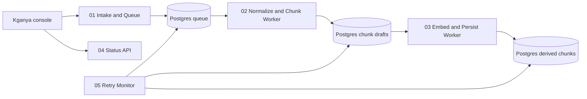

# Workflow Map

## Active Topology

See the split workflow set in:

- [01 Intake and Queue](workflows/01-intake-and-queue.md)
- [02 Normalize and Chunk Worker](workflows/02-normalize-and-chunk-worker.md)
- [03 Embed and Persist Worker](workflows/03-embed-and-persist-worker.md)
- [04 Status API](workflows/04-status-api.md)
- [05 Retry Monitor](workflows/05-retry-monitor.md)

## Legacy Reference

The legacy export is still stored in `n8n-workflow-export.json` for reference only.

## High-Level Flow

## Guiding Rule

Keep the webhook path short and make the database the durable handoff between workers.
